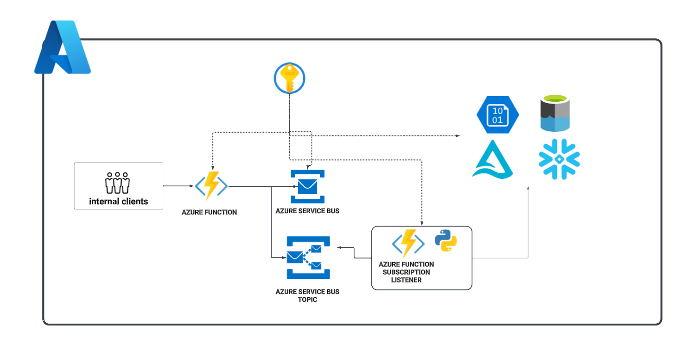

# vender-data-integration
#### In the realm of data engineering, timely access to data is crucial for making informed business decisions. This repository offers a solution for internal clients, such as data analysts and data scientists, who require immediate access to portions of data from various vendor data sources like Zoom, Teams, Workday, Canvas, Salesforce, Jira, and others.

#### The solution allows clients to send a JSON-based payload specifying the data they need to extract, along with details about the data source and extraction parameters, via Azure Service Bus. Upon receiving the payload in our Azure Service Bus topic, a listener function app in our ASB subscription is triggered. This app then extracts the requested data according to the provided parameters and flushes it to the relevant data lake or data warehouse for further analysis and decision-making.

